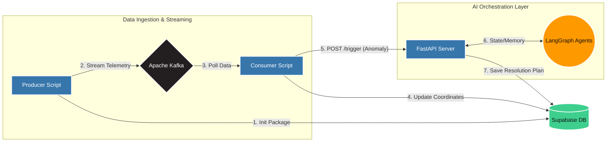

# Intelligent Freight System: Multi-Agent Anomaly Resolution Platform

## Overview

The Intelligent Freight System is a real-time, event-driven logistics platform designed to simulate, track, and autonomously resolve critical anomalies in global freight networks. By integrating high-frequency live flight telemetry with a multi-agent Large Language Model (LLM) orchestration layer, the system can detect transit deviations (e.g., thermal excursions, vibration spikes) and autonomously draft compliance-driven resolution directives.

## System Architecture & Data Flow


The architecture is built on a decoupled, stream-processing paradigm to ensure high availability and prevent bottlenecks during data surges.

### 1. Telemetry Ingestion (The Producer)

* **Mechanism:** Python-based stateful producer that interfaces with the OpenSky API to track live global air traffic. 
* **Logic:** Tracks packages in 10-minute lifecycle batches (polling every 30 seconds for high data resolution). Calculates geospatial distance using the Haversine formula and injects randomized sensor data (temperature, vibration).
* **Why:** Operating in local memory before publishing reduces unnecessary database reads, while the 30-second tick interval ensures anomalous sensor readings are caught before catastrophic failure.

### 2. Event Streaming (Apache Kafka)

* **Mechanism:** Containerized Apache Kafka and Zookeeper message broker.
* **Why:** Acts as the critical shock absorber. Relational databases are inefficient at handling thousands of concurrent row updates per second. Kafka queues the raw telemetry, providing backpressure management. This allows the system to scale horizontally via Consumer Groups without overwhelming downstream APIs or the primary database.

### 3. Stream Processing (The Consumer)

* **Mechanism:** Continuously polls the Kafka topic (`logistics.anomalies`).
* **Logic:** Acts as the routing gatekeeper. Standard positional updates are synced directly to the database. If a sensor threshold is breached (e.g., temperature > 35°C), it halts standard processing, flags the database to prevent duplicate triggers, and fires an HTTP POST request to the orchestration server.

### 4. Agentic Orchestration (FastAPI + LangGraph)

* **Mechanism:** A RESTful API built on FastAPI, serving as the interface for a LangGraph multi-agent network.
* **Logic:** Utilizes a concurrent threading model. FastAPI accepts asynchronous requests and assigns them to synchronous background worker threads. LangGraph initializes a local SQLite Checkpointer using the `package_id` as a thread identifier to maintain isolated conversational memory.
* **Agent Roles:**
* **Supervisor:** Evaluates the anomaly and delegates tasks.
* **Compliance:** Cross-references incident parameters against regulatory frameworks (e.g., Hazmat routing, UN3480 Lithium-Ion restrictions).
* **Dispatch:** Formulates the final rerouting and isolation directives based on compliance constraints.


### 5. Persistent Storage (Supabase)

* **Mechanism:** Cloud-hosted PostgreSQL with Row-Level Security (RLS) configured for secure API access.
* **Why:** Provides the central source of truth for all active freights, historical routes, and final AI-generated resolution summaries.

---

## Repository Structure

```text
intelligent_freight_system/
├── agents/
│   ├── __init__.py
│   ├── state.py            # LangGraph state schema definition
│   ├── sub_agents.py       # Logic for Compliance and Dispatch agents
│   ├── supervisor.py       # Graph compilation and routing logic
│   └── tools.py            # Tool definitions (e.g., policy retrieval)
├── api/
│   ├── __init__.py
│   ├── main.py             # FastAPI application initialization
│   ├── routes.py           # REST endpoints (/trigger, /status)
│   └── schemas.py          # Pydantic models for request/response validation
├── core/
│   ├── __init__.py
│   ├── config.py           # Environment variable management
│   ├── db.py               # Supabase client instantiation
│   └── logger.py           # Centralized logging configuration
├── mock_services/
│   ├── __init__.py
│   ├── flight_api.py       # Fallback OpenSky simulation logic
│   └── hr_api.py           # Mock external service integrations
├── streaming/
│   ├── __init__.py
│   ├── consumer.py         # Kafka consumer and DB sync logic
│   └── producer.py         # Telemetry generation and Kafka publishing
├── docker-compose.yaml     # Kafka and Zookeeper container definitions
├── Dockerfile              # Containerization instructions for the Python app
├── requirements.txt        # Python dependencies
└── README.md               # Project documentation

```

*(Note: SQLite database files `.sqlite`, `.sqlite-shm`, `.sqlite-wal` are generated at runtime for LangGraph memory state management and are excluded from version control).*

---

## Setup and Installation

### Prerequisites

* Docker Desktop (for Kafka/Zookeeper)
* Python 3.10+
* Supabase Account & API Keys

### Environment Configuration

Create a `.env` file in the root directory and populate it with the following:

```env
SUPABASE_URL="your_supabase_project_url"
SUPABASE_KEY="your_supabase_anon_key"
OPENAI_API_KEY="your_openai_api_key"
KAFKA_BROKER_URL="localhost:9092"

```

### Installation Steps

1. **Initialize the Virtual Environment:**
```bash
python -m venv .venv
source .venv/Scripts/activate  # Windows
# source .venv/bin/activate    # Mac/Linux
pip install -r requirements.txt

```


2. **Boot the Messaging Infrastructure:**
```bash
docker-compose up -d

```


*Wait 15 seconds for Kafka's Java engine to allocate ports before proceeding.*
3. **Configure the Database:**
Ensure your Supabase table `tracked_packages` is created and that Row-Level Security (RLS) is either configured with appropriate INSERT/UPDATE policies or disabled for local development.

---

## Execution Flow

To simulate the live environment, four isolated terminal instances are required (ensure the virtual environment is activated in each).

**Terminal 1: The Orchestrator**
Starts the FastAPI server to listen for emergency events.

```bash
fastapi dev api/main.py

```

**Terminal 2: The Consumer**
Initiates the Kafka stream listener and database synchronization.

```bash
python -m streaming.consumer

```

**Terminal 3: The Producer**
Starts the 10-minute telemetry batch generation.

```bash
python -m streaming.producer

```

---

## API Reference

### `POST /api/v1/orchestrator/trigger`

Fired automatically by the Consumer upon anomaly detection. Initializes the LangGraph workflow.
**Payload:**

```json
{
  "package_id": "PKG-202606-ABCDEF",
  "current_location": "LAT: 23.31, LON: 87.31",
  "anomaly_type": "CRITICAL_THERMAL_EXCURSION"
}

```

### `GET /api/v1/orchestrator/status/{package_id}`

Retrieves the localized state snapshot directly from the LangGraph SQLite memory checkpointer, allowing programmatic review of the agent's decision-making history without querying the primary PostgreSQL database.